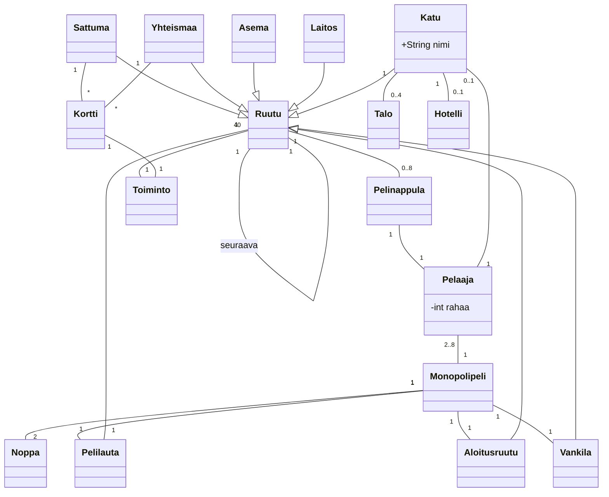

```mermaid
 classDiagram
    class Katu {
        +String nimi
    }

    class Pelaaja {
        -int rahaa
    }

    Aloitusruutu --|> Ruutu
    Vankila --|> Ruutu
    Sattuma --|> Ruutu
    Yhteismaa --|> Ruutu
    Asema --|> Ruutu
    Laitos --|> Ruutu
    Katu --|> Ruutu

    Monopolipeli "1" -- "2" Noppa
    Monopolipeli "1" -- "1" Pelilauta
    Pelilauta "1" -- "40" Ruutu
    Ruutu "1" -- "1" Ruutu : seuraava
    Ruutu "1" -- "0..8" Pelinappula
    Pelinappula "1" -- "1" Pelaaja
    Pelaaja "2..8" -- "1" Monopolipeli
    Monopolipeli "1" -- "1" Aloitusruutu
    Monopolipeli "1" -- "1" Vankila
    Ruutu "1" -- "1" Toiminto
    Sattuma "1" -- "*" Kortti
    Yhteismaa "1" -- "*" Kortti
    Kortti "1" -- "1" Toiminto
    Katu "1" -- "0..4" Talo
    Katu "1" -- "0..1" Hotelli
    Katu "0..1" -- "1" Pelaaja
```
